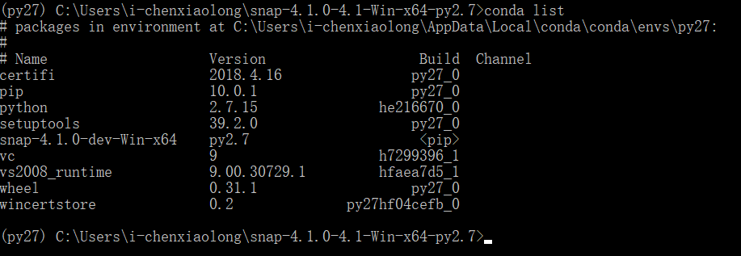

## 0 准备工作

[Downloads : Visual C++ Redistributable for Visual Studio 2012](https://www.microsoft.com/zh-CN/download/details.aspx?id=30679)

安装完毕即可

## 1 使用 python2 环境

    conda create -n py27 python=2.7

## 2 激活 activate py27 环境，并安装 snap

下载 snap : [snap-4.1.0-4.1-Win-x64-py2.7.zip](http://snap.stanford.edu/snappy/release/snap-4.1.0-4.1-Win-x64-py2.7.zip)

    activate py27
    cd snap-4.1.0-4.1-Win-x64-py2.7
    python setup.py install

可以看下，现在 python2 环境安装的包有哪些

上面可以看出基本的包在 python2 环境下都没有。

使用下面命令可以退出 python2 环境 
    
    deactivate 

## 3 安装 python2 需要的包

基本上安装 anaconda 会带有大量的基础包。

    conda install -n py27 anaconda

上面信息可以看出，conda 环境，默认是 Anaconda3

安装完毕后，再激活 python2 ，检查一下安装的包，可以看见大部分包都安装完成。

## 4 使用 jupyter

没问题后，使用下面命令，打开 jupyter

    jupyter-notebook

打开 jupyter 后，可以看见，只能 python2 可用

## 5 简单测试

