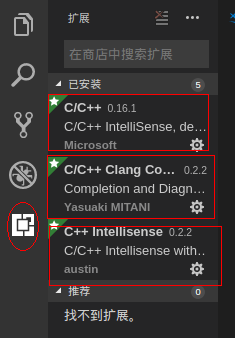
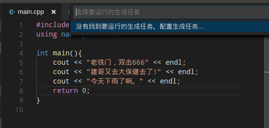
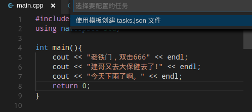
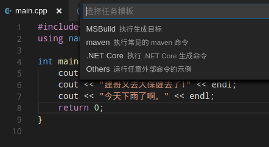
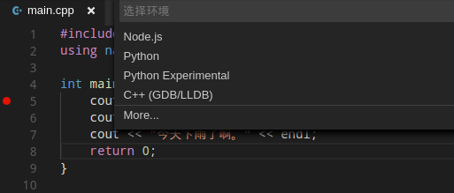
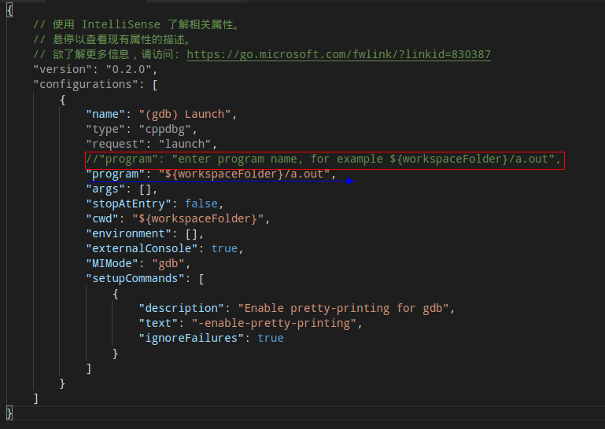

## 1 打开一个空文件夹

注：vscode调试必须在文件夹中进行。

## 2 安装C++的常用组件

## 3 新建一个C++文件

例如main.cpp文件

## 4 编辑代码，配置任务

编辑完成后，按Ctrl + Shift + B生成配置任务

点击此上方弹出内容

点击tasks.json文件

选择MSBuild模板

生成一个tasks.json文件，将里面的所有内容换成下面的语句

    {
        "version": "0.1.0",
        "command": "g++",
        "isShellCommand": true,
        "args": [
            "-g",
            "${workspaceRoot}/main.cpp"
        ],
        "showOutput": "always"
    }

**此为只有一个main.cpp的情况，如果有多个.cpp文件，则许添加多个文件，如下所示。**

{
    "version": "0.1.0",
    "command": "g++",
    "isShellCommand": true,
    "args": [
        "-g",
        "${workspaceRoot}/main.cpp",
        "${workspaceRoot}/main1.cpp",
        "${workspaceRoot}/main2.cpp"
    ],
    "showOutput": "always"
}

此时，再按Ctrl + Shift + B会生成可执行文件a.out

## 调试程序

设置断点，按F5进行调试。第一次会让选择环境，选C++(GDB/LLDB)即可。

此时，生成一个launch.json文件，配置此文件。

将红框内容，修改成下面的蓝线内容。

**注意，此为可执行文件为a.out的形式，如果是其他文件，则需要修改对应名称即可。**

此时，返回按F5，配合断点，F5执行到断点，F10执行下一步等信息即可调试。

